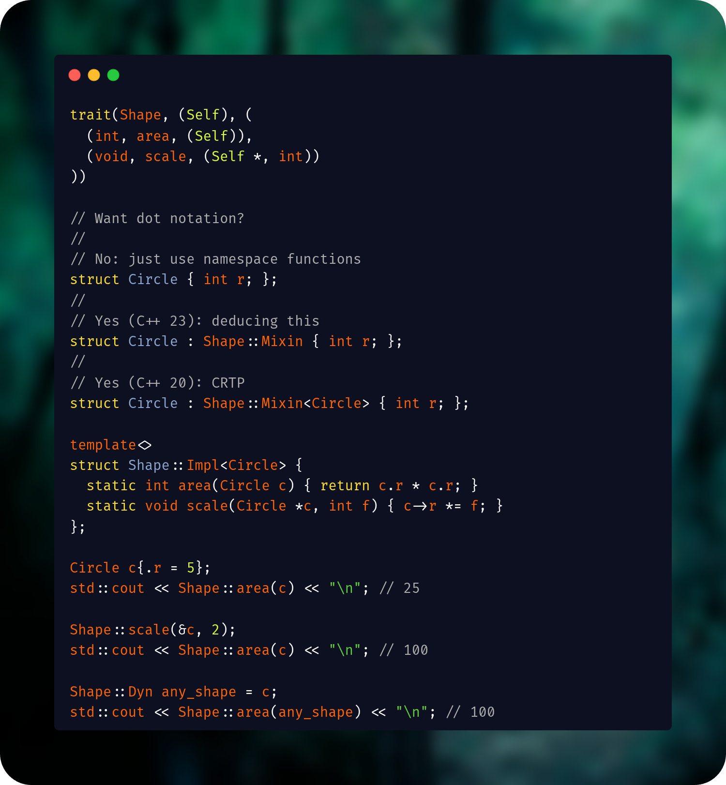

# cpp-trait

### Traits for C++ 20

Generate concepts, static dispatch forwarding functions, mixins, and opt-in type-erased dynamic dispatch from a single trait definition.

*Respects pointer semantics, performs no heap allocations, and no OOP required.*




## Goals

This library is designed to enhance **"C-style C++"** with more robust polymorphism capabilities that perform well, read well, and play well with C's memory paradigm.
That being said, Rust and Haskell are key inspirations for this library's approach to principled ad-hoc polymorphism.
If the library has done its job, writing trait-centric APIs should feel like you have the compositional power of Rust with the control of C.
As such, the following goals are north stars for this library:

- Readable APIs
- Single header
- Minimal reliance on C++ `std`
- No heap allocation
- Respect pointer semantics
- Static functions preferred to instance functions
- Recursive static dispatch works exactly as you would expect
- Static dispatch first, dynamic dispatch allowed via `Trait::Dyn` type
- Concepts for trait constraints instead of arcane SFINAE errors

## Non-goals

This library is not designed for traditional C++ OOP, but is rather an alternative to it.
Additionally, this library has no intention of replicating Rust in C++ for Rust's sake.
The following are not supported, and will never be supported:

- Automatic memory management
- Any implementation of Rust/C++ move semantics
- Robust compatibility with OOP hierarchies

## Examples

- [t1.cpp](https://github.com/elias-michaias/cpp-trait/blob/main/examples/t1.cpp)

## Use cases

### Multiple independent interfaces

A type can implement many traits without participating in a class hierarchy or incurring virtual table performance penalties.

```c++
struct Circle { int r; };

template<>
struct Area::Impl<Circle> { /* ... */ };

template<>
struct Drawable::Impl<Circle> { /* ... */ };

template<>
struct Serialize::Impl<Circle> { /* ... */ };
```

### Generic algorithms

Write algorithms against capabilities instead of concrete types.

```c++
// a static trait = no "Self", no vtable, no mixin
// can use first type arg as return or second param
static_trait(Add, (T), (
  (T, add, (T, T))
))

template <Add::Trait T>
T sum(T a, T b) {
  return Add::add(a, b);
}
```

### Associated types

Traits can define associated types to express dependent type relationships (e.g. a graph's `Edge` type or an iterator's `Item` type). 
*Note: Associated types can only be defined on a `static_trait`.*

```c++
static_trait(Test, (T), (
  (type, Factor),
  (T, test, (T, typename Impl<T>::Factor))
))

struct Container { int val; };

template<>
struct Test::Impl<Container> {
  // Define the associated type for this specific implementation
  using Factor = int; 
  
  static Container test(Container c, int f) { 
    return { c.val * f }; 
  }
};
```

### Strict traits vs. ducktyped traits

This library gives the programmer control over how types satisfy trait constraints. 

**Default (strict) traits:** By default, traits are strict. This means they inherently reject any of C/C++'s notorious implicit conversions, such as from `int` to `bool`.

```c++
trait(Drawable, (Self), (
  (void, draw, (Self *, bool))
))

template<>
struct Drawable::Impl<int> {
    void draw(int a, int b); // ERROR: int != bool
}
```

**Ducktyped traits:**  Ducktyped traits allow for C/C++'s implicit conversions to pass through. Useful when you have existing functions that already depend on weakly typed mechanisms.

```c++
ducktyped_trait(Drawable, (Self), (
  (void, draw, (Self *, bool))
))

template<>
struct Drawable::Impl<int> {
    void draw(int a, int b); // OK: int coerces to bool
}
```

### Alternative to virtual inheritance

Construct a simple non-owning fat pointer (e.g. `Drawable::Dyn`) for dynamic dispatch.

```c++
trait(Drawable, (Self), (
  (void, draw, (Self *))
))

void render(Drawable::Dyn obj) {
  Drawable::draw(obj);
}
```

### Recursive static dispatch

Traits can call other trait functions naturally during implementation.

```c++
trait(Print, (Self), (
  (void, print, (Self))
))

struct Pair {
  int left;
  int right;
};

template<>
struct Print::Impl<Pair> {
  static void print(Pair p) {
    Print::print(p.left);
    Print::print(p.right);
  }
};
```

## Why?

### I could write a concept myself

If you never care about dynamic dispatch or enforcing a standardized trait format, you can get what is essentially a trait without any macro or template trickery, simply by associating a concept with a shadowing `Impl` struct and some static forwarding functions. However, even for static dispatch, you have two places where every trait function name must appear (in the concept and in the forwarding functions) which can become annoying. If you ever care about dynamic dispatch, suddenly the obnoxious boilerplate expands to five sources of truth that must all be held in sync across every development iteration, which leads to buggy and annoying code. Using this library solves that by delivering a standardized, consistent, quality format from one unified syntax that gives the programmer the most control possible for the least word-vomit possible.

### I could use code generation

Code generation works but it's (usually) far from portable and introduces more build complexity that tricks your IDE. With this library, using an LSP "go to definition" functionality on a trait's namespace (e.g. `Shape`) actually takes you to the trait definition which includes all function signatures. Yes, it is macro-based, but macro-based is still considerably more favorable to your tooling (and your co-developers' tooling) than some other templating system or code generation script.

### I could use reflection

This may be true in ten years.

### Macros are evil

For business logic, usually. For one-and-done boilerplate, I personally feel like macros are fine, but the ways of the preprocessor are indeed mysterious and it won't hurt my feelings if you don't use this library.
